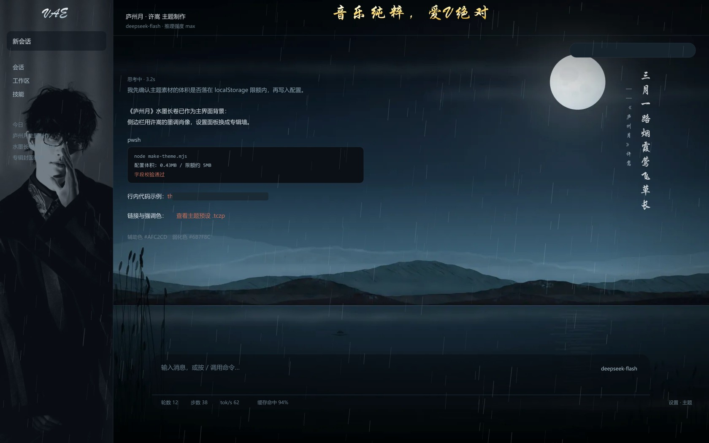
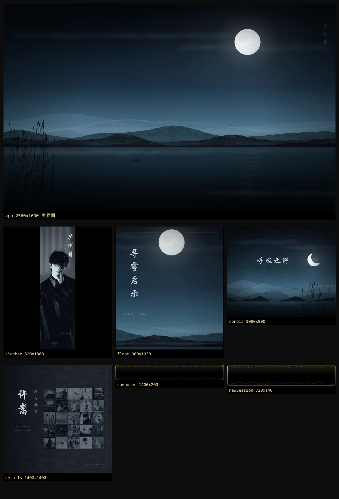
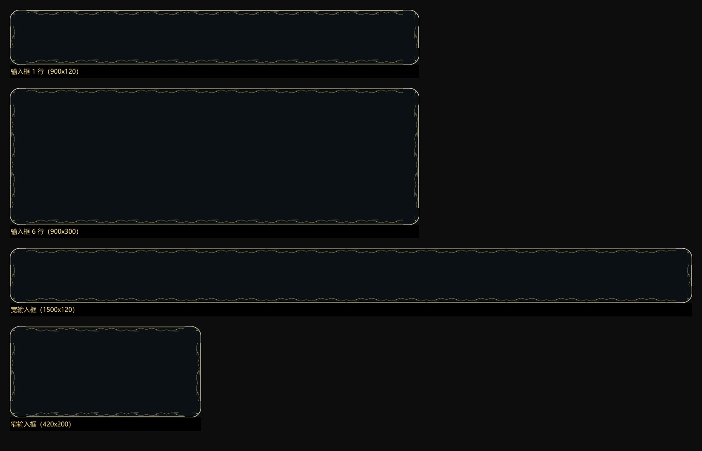
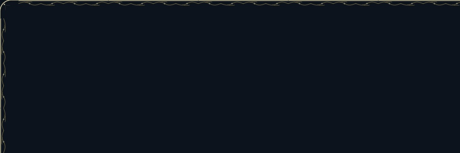

<div align="center">

# 庐州月 · 许嵩

**为 DeepSeek Harness 打造的国风水墨主题插件**

夜色水墨长卷 · 金丝九宫格边框 · VAE 书法标志 · 全屏雨幕 · 国风歌词竖排轮播

[](LICENSE)
[](#安装)

</div>

---

## 效果展示

### 整体界面



### 主视觉：夜色水墨长卷

程序生成的 3840×2400 水墨长卷 —— 远山四层淡墨、层间云带留白、月轮、水面涟漪、岸苇。


### 七个区域的资产



### 金丝九宫格边框

四角为固定尺寸角饰，四边为按固定波长平铺的边条 —— 因此**输入框无论拉多长多高，花纹大小恒定，且四边完整环绕**。



实际落在输入区上的效果（半透明玻璃 + 贴边金丝 + 紧贴边的细辫纹）：



### VAE 书法标志与金色导航字


### 侧边栏与 Cordis 面板

| 侧边栏 | Cordis 面板 |
|---|---|
|  |  |

---

## 插件描述

这是一个为 [DeepSeek Harness](https://github.com/) Web 界面制作的**完整界面主题**，以许嵩的国风作品《庐州月》为题。

它不只是换几张背景图，而是覆盖了 DSH 界面的**七个区域**，并额外注入**四项页面特效**：

| 区域 | 处理 |
|---|---|
| 主界面 | 夜色水墨长卷（无文字，避免与正文抢视觉） |
| 侧边栏 | 墨调肖像 + 上下淡出遮罩 |
| 输入区 | 半透明玻璃 + 金丝九宫格边框 |
| 新会话按钮 | 玻璃底 + 纯金框（去掉波浪，避免小尺寸下拥挤） |
| 设置面板 | 专辑墙 |
| Cordis 面板 | 专属绘制的水墨夜景（月牙 + 横排题字） |
| 浮窗面板 | 长卷裁切段 |

| 特效 | 说明 |
|---|---|
| VAE 书法标志 | 替换左上角官方 wordmark；折叠态自动换「许」字小标 |
| 顶部金色艺术字 | 「音乐纯粹，爱V绝对」 |
| 全屏雨幕 | Canvas 粒子雨，`mix-blend-mode: screen` |
| 国风歌词竖排轮播 | 对话区右侧留白，主栏歌词 + 左邻副栏出处 |

---

## 创作理念

**为什么是「庐州月」。** 许嵩写庐州，写的是"三月一路烟霞莺飞草长"，是"桥边红药叹夜太漫长"。这些句子里没有强烈的情绪，全是**景物**——烟霞、柳絮、月光、梨花雨。中国画的留白与淡墨，恰好能承接这种"不说破"的表达。所以整套视觉的语言基础不是"许嵩的照片墙"，而是**一幅画**。

**为什么整套视觉像一幅画，而不是七个拼凑的区域。** 主界面长卷、金丝边框、Cordis 面板的水墨夜景，用的是同一套笔法：淡墨积染的远山、留白的云带、含蓄的水面涟漪。看久了会发现它们本是一幅画里的不同段落，而不是七张各说各话的图——这比"每一处单独看都好看"更重要。

**为什么歌词只收国风、只收许嵩作词。** 初版歌词库里混进了《你若成风》《有何不可》这类情歌，和「庐州月」的气质完全不符。后来逐首核对，只保留许嵩本人作词的中国风作品。核对过程里还纠出两处旧库的错：

- 「桥边红药叹**夜夜微凉**」→ 原文是「桥边红药叹**夜太漫长**」
- 「半城烟沙 兵临**城下**」→ 原文是「半城烟沙 兵临**池下**」

粉丝向的作品，细节更该对得起原作。

**关于克制。** 这个主题改了很多轮，大部分改动是**做减法**：去掉印章图形、去掉背景里的简笔画建筑、去掉输入框的模糊、去掉新会话按钮的波浪纹、去掉九宫格里多余的辅助线、去掉侧边栏烧进图里的题字、去掉欢迎页的鲸鱼。

国风的要义在留白——多一笔都不行。

---

## 样式细节

### 色板

| 名称 | 值 | 用途 |
|---|---|---|
| 夜墨 | `#080D12` / `#0B1016` | 主背景、玻璃底 |
| 月白 | `#DCE5EA` / `#F6FAFC` | 正文、歌词主栏 |
| 黛青 | `#22343F` | 中景山体、次要文字 |
| 灰蓝 | `#8FA5B3` / `#CBDCE6` | 弱化文字、歌词副栏 |
| 朱砂 | `#B23A2E` | **仅作强调色**（全局不使用任何印章图形） |
| 金 | `#F9EDBC` → `#C9A03C` | 金丝边框、艺术字渐变 |

### 字体

| 用途 | 字体 | 说明 |
|---|---|---|
| **书法字**（VAE 标志、金色艺术字） | 华文行楷 `STXingkai` | 需要书写感的地方 |
| **落款**（歌词出处） | 华文楷体 `STKaiti` | |
| **歌词主栏** | 华文行楷 `STXingkai` | |
| **新会话欢迎页标题** | **思源宋体 `Noto Serif SC`** | 开源字体（SIL OFL）。宋体撇捺有锋芒、但不带楷体的书写体势，正好落在「太有气质」与「太干燥」之间；回退链 `Source Han Serif SC → STZhongsong → 华文中宋 → SimSun` |
| **界面** | 系统默认 | 主题不改界面字体，保持 DSH 原生可读性 |

### 金丝九宫格边框

单张图 + `cover` / `100%` 拉伸都会让花纹随框尺寸缩放——宽扁输入框上甚至会把上下金边整条裁掉。改用**九宫格**：

| 部件 | 尺寸 | 渲染方式 |
|---|---|---|
| 四角 | 36×36（输入区）/ 22×22（按钮） | 固定尺寸，`no-repeat` 贴四角 |
| 上下边 | 176×36 可平铺条 | `repeat-x`，按固定波长重复 |
| 左右边 | 36×176 纵向条 | `repeat-y` |

CSS 用 `html body` 前缀压过插件自带的 `!important`。整圈只有**一根贴边金丝 +（输入区）一条紧贴边的细辫纹**，不再有平行辅助线。

### 歌词竖排

```
对话区右侧留白
   ┌─ 主栏（歌词）      27px  月白 #F6FAFC  不透明度 .8
   └─ 副栏（出处）      14px  灰蓝 #CBDCE6  紧靠主栏左侧 44px，下错 28px
```

- 用 `writing-mode: vertical-rl` + `text-orientation: upright` 实现真竖排
- 传统竖排自右向左阅读 → **正文在右、落款在左**
- 相邻两句尽量来自不同曲目，**纯随机**抽取（仅约束不连续重复同一条）
- 长句自动缩字号：超过 16 字逐级下调，保证整列不超过视口高度 62%
- 纵向定位：短句以 34% 处为视觉中点居中；**长句上边缘钉在导航栏下方 96px，只向下延伸**

---

## 技术实现要点

几个值得一提的工程细节：

**① 内容哈希版本号。** 写入 localStorage 的种子版本号由主题配置与运行时的**内容哈希**导出。内容没变就不重刷，内容变了自动换号——避免"改了配置但浏览器跳过写入"的旧配置残留问题。

**② 实测定位，不做假设。** 歌词栏的落点不是写死的，而是在中列 DOM 里**实际扫描**出正文列右缘（取"明显窄于中列、且高度足够"的元素中最靠右的边缘），再把歌词摆在留白正中。

**③ 首帧位置稳定。** 启动时 React 还没渲染完，此时测量会得到错值。所以启动逻辑**等到连续两次量到同一个真实右缘**才定稿，并且**显示后不再改位置**——否则会看到歌词"横向跳一下"。

**④ 自诊断通道。** 运行时会把实测 DOM 尺寸回传到 `/vae-theme-report`，可在自检接口读到：中列/侧边栏矩形、歌词落点、VAE 居中偏差、乃至折叠态下底部每个元素的坐标与父级 flex 属性。**遇到布局问题先看数据，不靠猜。**

**⑤ 图片内容居中。** 背景图用 `background-position: center` 居中的是**整张画布**——画布内容不居中，字看起来就偏。生成器里加了 `centerInk()`：按墨迹包围盒自动裁切再对称留白，并附居中复核。

**⑥ 透明输入框上方的对话裁切。** 输入框是半透明玻璃，滚上来的对话文字会透过它与输入内容重叠。不做模糊（会糊掉背景长卷），改为给**对话内容本身**（`[data-chat-flow]`）加 CSS `mask-image`：正文在分隔线处淡出，背景自然透出。

这里有个坑：`mask-image` 会作用于元素**及其全部后代**（`position: fixed` 的后代也逃不掉）。最初把 mask 加在了它的**滚动祖先**上，而那个容器同时装着输入框——结果**输入框被一起隐藏了**。正确做法是只 mask 内容节点。又因为内容会滚动而裁切线要固定在屏幕上，mask 位置需随滚动重算（`scroll` 用捕获阶段监听，rAF 节流）。

**⑦ 状态变化收不到通知的兜底。** 右侧栏开合只改宽度或 `class`、不增删节点，`MutationObserver` 的 `childList` 收不到，导致"藏得掉、回不来"。除修检测逻辑外，再加一个 300ms 周期校准——不依赖任何事件，状态最终必然收敛。

---

## 安装

### 前置

- DeepSeek Harness（Web 端）
- 已安装 [`dsh-theme-customizer`](https://www.npmjs.com/package/dsh-theme-customizer)（主题配置的载体）

### 方式一：作为 DSH 插件（完整效果）

```bash
cd ~/.dsh/profiles/web
npm install <本仓库发布的包名>
```

然后把包名加进 `package.json` 的 `dsh.profile.bundles` 数组，重启 DSH。

装好后**自动生效**，无需手动导入预设。

### 方式二：从源码本地挂载（开发者）

```bash
git clone https://github.com/StevenZha0/dsh-vae-theme.git
cd ~/.dsh/profiles/web
npm install link:/绝对路径/dsh-vae-theme
```

`package.json`：

```json
{
  "dependencies": { "dsh-vae-theme": "link:/绝对路径/dsh-vae-theme" },
  "dsh": { "profile": { "bundles": ["...", "dsh-vae-theme"] } }
}
```

### 方式三：只导入主题预设

`lib/theme.tczp` 是标准的 `dsh-theme-customizer` 预设文件，在定制器面板点 **📥 导入预设** 即可。

> 注意：方式三**只含配色与七区域背景图**，不含页面特效。

---

## 目录详情

```
.
├── README.md               本文档
├── LICENSE                 MIT（仅覆盖代码，见「版权说明」）
├── 版权说明.md              第三方素材清单与处理建议
├── package.json            npm 包清单（dsh.bundle.patch 指向 cordis.patch.yml）
├── cordis.patch.yml        bundle 层：插入 vae-theme 插件行
├── lyrics.mjs              歌词库（24 首国风曲目 / 160 句）
├── lib/
│   ├── index.js            Cordis 插件主体
│   │                       注册 /vae-theme-seed.js、/vae-theme-apply、
│   │                       /vae-theme-report、/vae-theme-status 四条路由，
│   │                       并把种子脚本注入 index.html 的 <head>
│   ├── runtime.js          页面运行时装（注入到浏览器执行）
│   │                       ① VAE 标志替换  ② 金色艺术字  ③ 九宫格金丝边框
│   │                       ④ 全屏雨幕      ⑤ 竖排歌词    ⑥ 折叠态页脚归一化
│   └── theme.tczp          主题预设（七区域配置 + 全部图片，约 436KB）
├── docs/                   截图资源
└── tools/                  资产生成与自检脚本（可选，仅开发用）
    ├── make-scroll.mjs       主视觉水墨长卷
    ├── make-frames.mjs       九宫格边框 + Cordis 面板
    ├── make-logo.mjs         VAE 标记 + 金色导航字（含居中复核）
    ├── make-sidebar.mjs      侧边栏墨调肖像
    ├── make-panels-v2.mjs    输入区 / 新会话 / 浮窗
    ├── make-runtime.mjs      生成 lib/runtime.js
    ├── make-theme.mjs        打包成 lib/theme.tczp
    ├── make-mockup.mjs       界面效果模拟图
    ├── make-lyrics-doc.mjs   由 lyrics.mjs 生成歌词清单文档
    └── test-plugin.mjs       静态插件离线自检（路由、注入顺序、幂等性）
```

### 自检接口

装好后访问 `http://127.0.0.1:3080/vae-theme-status`：

```json
{
  "seedVersion": "vae-xxxxx-yyyyy",
  "checks": {
    "areaCount": 7,
    "payloadKB": 436,
    "runtimeKB": 124,
    "indexInjection": true
  },
  "pageReport": {
    "diag":  { "vw": 1707, "sidebarW": 280, "right": 105 },
    "brand": { "center": 140, "sidebarCenter": 140, "offset": 0 }
  }
}
```

一键应用：`http://127.0.0.1:3080/vae-theme-apply`

---

## 自定义扩展

### 一、扩充歌词库（最常见）

歌词全部集中在 `lyrics.mjs`，按曲目分组：

```js
export const SONGS = [
  {
    title: '山水之间',
    lines: [
      '昨夜同门云集 推杯又换盏',
      '隐居山水之间 誓与浮名散',
      // 一首歌可以放任意多句
    ],
  },
  // 继续追加曲目……
]
```

改完重新生成运行时：

```bash
node tools/make-runtime.mjs     # 生成 lib/runtime.js
node tools/make-theme.mjs       # 重新打包 lib/theme.tczp
node tools/test-plugin.mjs      # 自检
```

然后刷新页面即可（种子版本号是内容哈希，会自动换号触发重刷）。

**收录建议**：只收**国风**曲目、只收**许嵩本人作词**的作品，并逐字核对来源。
`songs` 数组的顺序不影响播放——运行时是**纯随机**抽取的。

### 二、改配色

配色写在 `tools/make-theme.mjs` 顶部的 `C` 对象里：

```js
const C = {
  ink:      '#080D12',   // 夜墨
  moon:     '#DCE5EA',   // 月白
  dai:      '#22343F',   // 黛青
  aux:      '#8FA5B3',   // 灰蓝
  accent:   '#B23A2E',   // 朱砂（强调色）
  // ...
}
```

改完 `node tools/make-theme.mjs`。若只是临时试色，也可以直接在浏览器里改 localStorage：

```js
const c = JSON.parse(localStorage.getItem('theme-customizer-config-v1'))
c.colors.main = '#F0F6FA'
localStorage.setItem('theme-customizer-config-v1', JSON.stringify(c))
// 刷新
```

### 三、替换某个区域的图片

每个区域的配置形如：

```json
{
  "mode": "image",
  "opacity": 0.10,
  "image": { "dataURI": "data:image/webp;base64,...", "fileName": "xxx.webp", "fit": "cover" },
  "bottomEnabled": true, "bottomColor": "#080D12", "bottomOpacity": 0.50
}
```

> ⚠️ **透明度语义是「数值大 = 更透明」**（alpha = 1 − opacity）。
> 所以 `opacity: 0` 是**完全不透明**，`opacity: 1` 才是全透明。

也可以直接换成纯色：把 `mode` 改为 `"none"` 或 `"color"`。

### 四、重新生成全部资产

```bash
npm install sharp              # tools/ 依赖 sharp

node tools/make-scroll.mjs     # 主视觉长卷（3840×2400，约 2–3 分钟）
node tools/make-frames.mjs     # 九宫格边框 + Cordis 面板
node tools/make-logo.mjs       # VAE 标记 + 金色导航字
node tools/make-sidebar.mjs    # 侧边栏（需自备 raw/web/*.jpg）
node tools/make-panels-v2.mjs  # 输入区 / 新会话 / 浮窗
node tools/make-runtime.mjs    # 运行时装
node tools/make-theme.mjs      # 打包 .tczp
```

**需要的原始素材**（仓库未附带）：

```
raw/
├── web/          侧边栏肖像等
└── albums/       专辑封面（用于设置面板专辑墙）
```

> ⚠️ `tools/` 里的脚本含中文，**请用编辑器修改，不要用 PowerShell 的 `Get-Content -Raw` 读写**——它会按 ANSI 解码，导致注释乱码并吃掉换行。

### 五、关闭特效

浏览器控制台执行后刷新：

```js
localStorage.setItem('vae-theme-fx', 'off')
```

### 六、改特效行为

特效全部在 `tools/make-runtime.mjs` 里：

| 想改什么 | 找哪里 |
|---|---|
| 雨滴数量 / 速度 / 角度 | `startRain()` 里的 `COUNT`、`vy`、`tilt` |
| 歌词轮播节奏 | `show()` 里 `setTimeout(..., 7600)` 与 `setTimeout(show, 9200)` |
| 歌词字号 / 颜色 / 不透明度 | CSS 数组里的 `.vae-vcol`、`.vae-vline`、`.vae-vsrc` |
| 歌词垂直落点 | `place()` 里的 `vh * 0.34` 与 `minTop = 96` |
| 歌词横向落点 | `place()` 里的 `gutter / 2 - 30` |
| VAE 标志尺寸 | `.vae-brand` 的 `max-width: 132px` / `height: 34px` |
| **新会话欢迎页标题文案** | `heroSwap()` 里的 `HERO_TEXT`（默认「快写一段提示词雅俗共赏~」） |
| 隐藏欢迎页鲸鱼 / 预览版徽标 | CSS 里的 `[class*="_fishHitbox"]` / `[class*="_previewBadge"]` |
| 输入区上方分隔线的位置 | `chatDivider()` 里的 `sr.top - 14`（`14` 即线上方留白） |
| 分隔线的粗细与深浅 | CSS 里 `#vae-chat-divider` 的 `height` 与渐变中的 `.15` |
| 对话裁切的淡出长度 | `applyFlowMask()` 里的 `maskY - 14`；mask 目标为 `[data-chat-flow]` |
| 金色字避让右侧栏 | `rightbarOpen()` 的两条判据（右栏列宽 > 60 / 中列右缘空隙 > 60） |
| 状态校准周期 | `boot()` 里 `setInterval(placeGold, 300)` |

---

## 版权说明

代码以 **MIT** 授权。但需要注意，主题内嵌的**图像与文本**来源不同：

| 类别 | 内容 | 授权 |
|---|---|---|
| **程序生成** | 水墨长卷、九宫格金丝边框、Cordis 面板夜景、VAE 书法标志、金色导航字、输入区/新会话/浮窗 | 随 MIT 分发 |
| **第三方** | 侧边栏肖像照片、设置面板专辑封面、`lyrics.mjs` 歌词文本 | 版权属各自权利人 |

本仓库是**粉丝向非商业作品**，与许嵩先生及其经纪公司、与 DeepSeek 均无任何关联，
不使用任何官方标识。第三方素材版权归各自权利人所有，如权利人提出异议将立即移除。

详见 [`版权说明.md`](版权说明.md)。

---

## 致谢

- 主题的歌词全部来自**许嵩本人作词的中国风作品**，版权归许嵩先生所有
- 界面载体为 [DeepSeek Harness](https://github.com/)，主题通过
  [`dsh-theme-customizer`](https://www.npmjs.com/package/dsh-theme-customizer) 承载
- 图像生成依赖 [sharp](https://sharp.pixelplumbing.com/)（libvips）

---

## License

[MIT](LICENSE) © 2026
