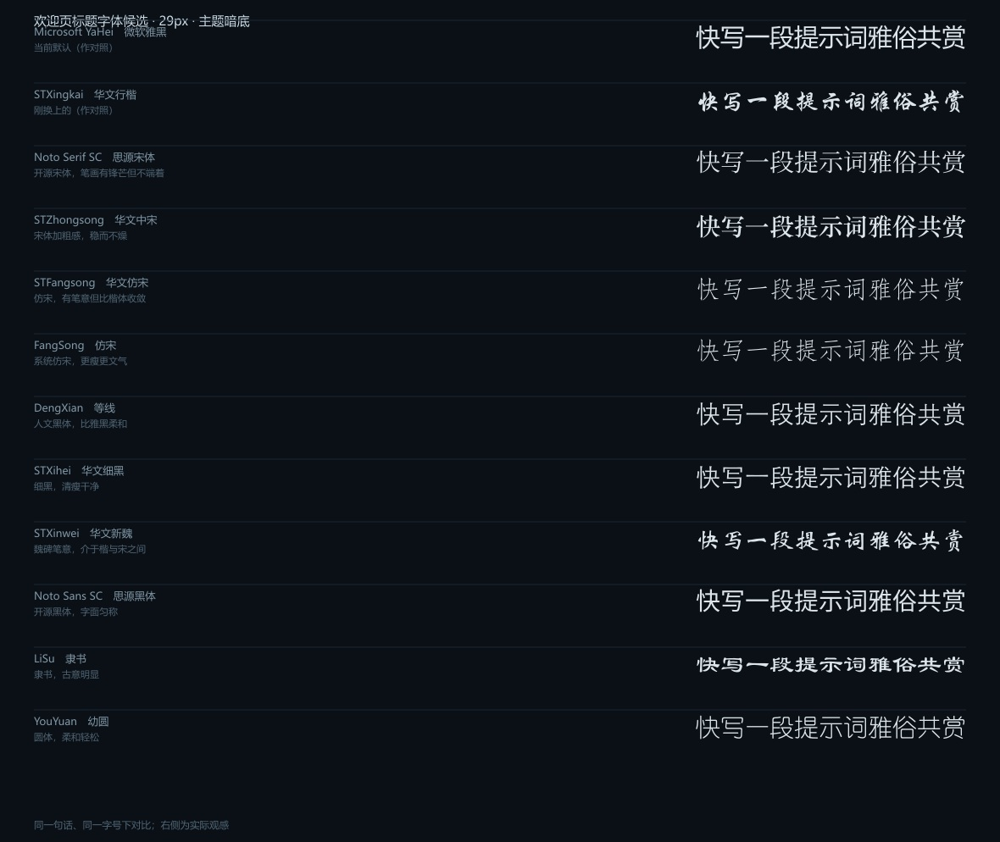

<div align="center">

# 庐州月 · 许嵩

**为 DeepSeek Harness 打造的国风水墨主题**

夜色水墨长卷 · 金丝边框 · VAE 书法标志 · 全屏雨幕 · 国风歌词轮播

[](LICENSE)

</div>

---

## 效果展示

### 整体界面


### 主视觉：夜色水墨长卷

远山四层淡墨、层间云带留白、月轮、水面涟漪、岸苇。


### 七个区域


### 金丝边框

边框的四角与四边分开绘制，所以**输入框无论拉多长多高，花纹大小恒定，四边始终完整环绕**。


落在输入区上的实际效果（半透明玻璃 + 贴边金丝）：


### 艺术字


### 侧边栏与 Cordis 面板

| 侧边栏 | Cordis 面板 |
|---|---|
|  |  |

---

## 这是什么

一套以许嵩《庐州月》为题的 **DeepSeek Harness 界面主题**，面向许嵩粉丝社区。

界面语言取自中国画的留白与淡墨：主视觉是一幅夜色水墨长卷，界面各处点缀金丝边框与书法字，
再用雨幕和国风歌词把静态的界面带活。

主题覆盖 DSH 的**七个区域**，并额外加入**四项页面特效**。

## 有什么

### 七个区域

| 区域 | 内容 |
|---|---|
| 主界面 | 夜色水墨长卷（不含文字，避免与正文抢视觉） |
| 侧边栏 | 墨调肖像，上下淡出 |
| 输入区 | 半透明玻璃 + 金丝边框 |
| 新会话按钮 | 玻璃底 + 纯金框 |
| 设置面板 | 专辑墙 |
| Cordis 面板 | 独立绘制的水墨夜景（月牙 + 横排题字） |
| 浮窗面板 | 长卷的一段裁切 |

### 四项特效

| 特效 | 说明 |
|---|---|
| VAE 书法标志 | 替换左上角官方标志；侧边栏收起时自动换成「许」字小标 |
| 顶部金色艺术字 | 「音乐纯粹，爱V绝对」；右侧栏展开时自动让位 |
| 全屏雨幕 | 细密的斜雨，叠在整幅长卷之上 |
| 国风歌词轮播 | 对话区右侧留白，竖排显示歌词与出处 |

---

## 设计细节

### 配色

| 名称 | 值 | 用途 |
|---|---|---|
| 夜墨 | `#080D12` / `#0B1016` | 主背景、玻璃底 |
| 月白 | `#DCE5EA` / `#F6FAFC` | 正文、歌词主栏 |
| 黛青 | `#22343F` | 中景山体、次要文字 |
| 灰蓝 | `#8FA5B3` / `#CBDCE6` | 弱化文字、歌词副栏 |
| 朱砂 | `#B23A2E` | 仅作强调色（全局不使用印章图形） |
| 金 | `#F9EDBC` → `#C9A03C` | 金丝边框、艺术字 |

### 字体

| 用途 | 字体 |
|---|---|
| 书法字（VAE 标志、金色艺术字） | 华文行楷 |
| 歌词主栏 | 华文行楷 |
| 歌词出处 | 华文楷体 |
| 新会话欢迎页标题 | 思源宋体 |
| 界面其余部分 | 系统默认（不改动，保持 DSH 原生可读性） |

欢迎页标题的字体试过好几款，把候选放在一起对比过，留了张图备查：



### 歌词

对话区右侧留白竖排显示，主栏是歌词、左邻副栏是出处——传统竖排自右向左阅读，所以正文在右、落款在左。

收录 **24 首许嵩本人作词的中国风作品、共 160 句**，逐字核对多个来源。播放为**纯随机**抽取，
不会连续重复同一句。

---

## 创作理念

**为什么是「庐州月」。** 许嵩写庐州，写的是"三月一路烟霞莺飞草长"，是"桥边红药叹夜太漫长"。这些句子里没有强烈的情绪，全是**景物**——烟霞、柳絮、月光、梨花雨。中国画的留白与淡墨，恰好能承接这种"不说破"的表达。所以整套视觉的语言基础不是"许嵩的照片墙"，而是**一幅画**。

**为什么整套视觉像一幅画，而不是七个拼凑的区域。** 主界面长卷、金丝边框、Cordis 面板的水墨夜景，用的是同一套笔法：淡墨积染的远山、留白的云带、含蓄的水面涟漪。看久了会发现它们本是一幅画里的不同段落，而不是七张各说各话的图——这比"每一处单独看都好看"更重要。

**为什么歌词只收国风、只收许嵩作词。** 初版歌词库里混进了《你若成风》《有何不可》这类情歌，和「庐州月」的气质完全不符。后来逐首核对，只保留许嵩本人作词的中国风作品。核对过程里还纠出两处旧库的错：

- 「桥边红药叹**夜夜微凉**」→ 原文是「桥边红药叹**夜太漫长**」
- 「半城烟沙 兵临**城下**」→ 原文是「半城烟沙 兵临**池下**」

粉丝向的作品，细节更该对得起原作。

**关于克制。** 这个主题改了很多轮，大部分改动是**做减法**：去掉印章图形、去掉背景里的简笔画建筑、去掉输入框的模糊、去掉新会话按钮的波浪纹、去掉边框上多余的辅助线、去掉侧边栏烧进图里的题字、去掉欢迎页的鲸鱼。

国风的要义在留白——多一笔都不行。

---

## 怎么用

### 前置

- DeepSeek Harness（Web 端）
- 已安装 [`dsh-theme-customizer`](https://www.npmjs.com/package/dsh-theme-customizer)

### 方式一：装成 DSH 插件（推荐，效果完整）

```bash
cd ~/.dsh/profiles/web
npm install dsh-vae-theme
```

然后把 `dsh-vae-theme` 加进同目录 `package.json` 的 `dsh.profile.bundles` 数组，重启 DSH。

装好后**自动生效**，不需要手动导入预设。

### 方式二：从源码本地挂载（想改东西的人用）

```bash
git clone https://github.com/StevenZha0/dsh-vae-theme.git
cd ~/.dsh/profiles/web
npm install link:/绝对路径/dsh-vae-theme
```

`package.json`：

```json
{
  "dependencies": { "dsh-vae-theme": "link:/绝对路径/dsh-vae-theme" },
  "dsh": { "profile": { "bundles": ["...", "dsh-vae-theme"] } }
}
```

### 方式三：只导入主题预设（最省事，但不含特效）

`lib/theme.tczp` 是标准的 `dsh-theme-customizer` 预设文件。把它发给别人，
在定制器面板点 **📥 导入预设** 即可。

> 这种方式**只有配色和七个区域的背景图**，没有书法标志、金色艺术字、雨幕和歌词轮播。

### 确认装好了

浏览器打开 `http://127.0.0.1:3080/vae-theme-status`，看到 `"verdict": "✅ 已就绪"` 就对了。

### 暂时关掉特效

浏览器控制台执行后刷新：

```js
localStorage.setItem('vae-theme-fx', 'off')
```

---

## 目录结构

```
.
├── README.md
├── LICENSE               MIT（仅覆盖代码，见「版权说明」）
├── 版权说明.md            第三方素材清单与处理建议
├── package.json
├── cordis.patch.yml      安装时告诉 DSH 加载本插件
├── lyrics.mjs            歌词库（24 首 / 160 句）
├── lib/
│   ├── index.js          插件本体
│   ├── runtime.js        页面特效
│   └── theme.tczp        主题预设（七个区域配置 + 图片）
├── docs/                 效果图
└── tools/                资产生成脚本（可选，想重做背景图时才用）
```

---

## 怎么拓展

### 一、扩充歌词库（最常见）

歌词全部在 `lyrics.mjs`，按曲目分组：

```js
export const SONGS = [
  {
    title: '山水之间',
    lines: [
      '昨夜同门云集 推杯又换盏',
      '隐居山水之间 誓与浮名散',
      // 一首歌想放几句就放几句
    ],
  },
  // 继续追加曲目……
]
```

改完跑一遍：

```bash
node tools/make-runtime.mjs     # 生成 lib/runtime.js
node tools/make-theme.mjs       # 重新打包 lib/theme.tczp
```

刷新页面即可。

**收录建议**：只收国风曲目、只收许嵩本人作词的作品，并逐字核对来源。
曲目的排列顺序不影响播放——播放是纯随机的。

### 二、换配色

配色在 `tools/make-theme.mjs` 顶部的 `C` 对象里：

```js
const C = {
  ink:    '#080D12',   // 夜墨
  moon:   '#DCE5EA',   // 月白
  dai:    '#22343F',   // 黛青
  aux:    '#8FA5B3',   // 灰蓝
  accent: '#B23A2E',   // 朱砂
}
```

改完 `node tools/make-theme.mjs`。

### 三、换某个区域的图

每个区域在主题预设里形如：

```json
{
  "mode": "image",
  "opacity": 0.10,
  "image": { "dataURI": "data:image/webp;base64,...", "fit": "cover" }
}
```

> ⚠️ **透明度是反的：数值越大越透明**（`opacity: 0` 是完全不透明，`1` 才是全透明）。
> 这是 `dsh-theme-customizer` 的约定，容易踩坑。

也可以直接把 `mode` 改成 `"color"` 用纯色，或 `"none"` 不用图。

### 四、重做背景图

```bash
npm install sharp              # tools/ 需要
node tools/make-scroll.mjs     # 水墨长卷（约 2–3 分钟）
node tools/make-frames.mjs     # 金丝边框 + Cordis 面板
node tools/make-logo.mjs       # VAE 标志 + 金色艺术字
node tools/make-panels-v2.mjs  # 输入区 / 新会话 / 浮窗
node tools/make-runtime.mjs    # 页面特效
node tools/make-theme.mjs      # 打包预设
```

侧边栏肖像与专辑墙需要自备素材，放在：

```
raw/web/        侧边栏肖像等
raw/albums/     专辑封面（设置面板的专辑墙）
```

> ⚠️ `tools/` 里的脚本含中文，**请用编辑器修改，不要用 PowerShell 的 `Get-Content -Raw` 读写**——它会按 ANSI 解码，导致注释乱码并吃掉换行。

### 五、改特效的样子

特效都在 `tools/make-runtime.mjs`：

| 想改什么 | 找哪里 |
|---|---|
| 雨滴数量 / 速度 | `startRain()` |
| 歌词轮播快慢 | `show()` 里的两个 `setTimeout` |
| 歌词字号、颜色、透明度 | `.vae-vcol` / `.vae-vline` / `.vae-vsrc` 这几条样式 |
| 歌词的上下位置 | `place()` 里的 `vh * 0.34` |
| 歌词的左右位置 | `place()` 里的 `gutter / 2 - 30` |
| VAE 标志大小 | `.vae-brand` 的 `max-width` 与 `height` |
| 欢迎页标题文案 | `heroSwap()` 里的 `HERO_TEXT` |
| 输入区上方分隔线 | `chatDivider()` 与 `#vae-chat-divider` 样式 |

改完跑 `node tools/make-runtime.mjs`。

---

## 版权说明

代码以 **MIT** 授权。但主题里的**图像与文本**来源不同：

| 类别 | 内容 | 授权 |
|---|---|---|
| 主题画面 | 水墨长卷、金丝边框、Cordis 面板夜景、VAE 标志、金色艺术字、输入区 / 新会话 / 浮窗 | 随 MIT 分发 |
| 第三方素材 | 侧边栏肖像照片、设置面板专辑封面、`lyrics.mjs` 歌词文本 | 版权属各自权利人 |

本仓库是**粉丝向非商业作品**，与许嵩先生及其经纪公司、与 DeepSeek 均无任何关联，
不使用任何官方标识。第三方素材版权归各自权利人所有，如权利人提出异议将立即移除。

详见 [`版权说明.md`](版权说明.md)。

---

## 致谢

- 歌词全部来自**许嵩本人作词的中国风作品**，版权归许嵩先生所有
- 界面载体为 [DeepSeek Harness](https://github.com/)，主题通过
  [`dsh-theme-customizer`](https://www.npmjs.com/package/dsh-theme-customizer) 承载
- 图像生成使用 [sharp](https://sharp.pixelplumbing.com/)

---

## License

[MIT](LICENSE) © 2026
